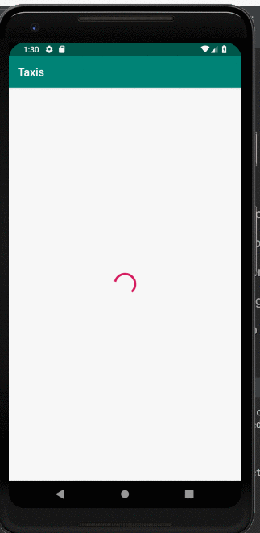

# HereExercise
Here MVVM cabs

Small modern android app based MVVM architecture and bunch of great libraries/features/classes such as:

* <b>ViewModel</b> - Store and manage UI-related data in a lifecycle
* <b>LiveData</b> - Observable data holder, lifecycle-aware
* <b>RXJava2</b> - Observer Pattern
* <b>Dagger2</b> - Dependency Injection
* <b>ButterKnife</b> - View Injection
* <b>Retrofit</b> - Network
* <b>Room</b> - DB
* <b>RecyclerView</b> - List
* <b>Glide</b> - Images

